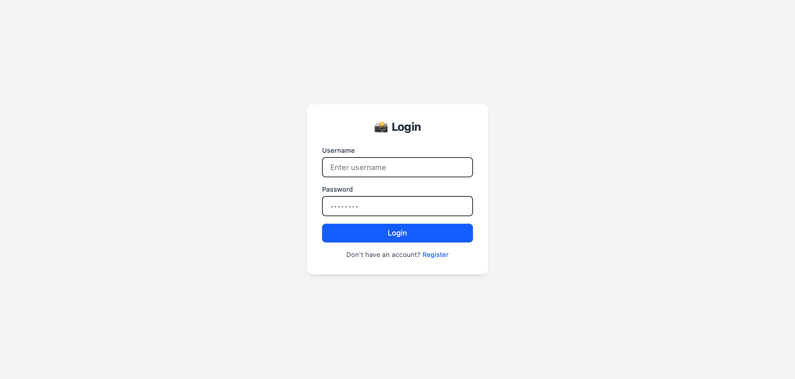
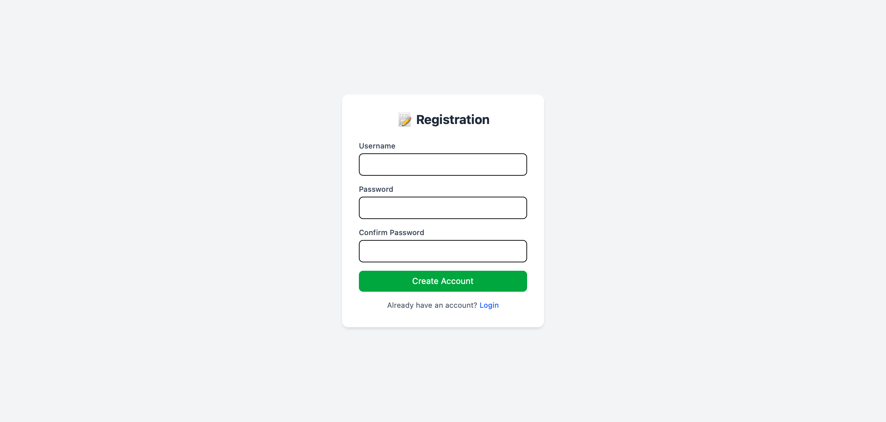
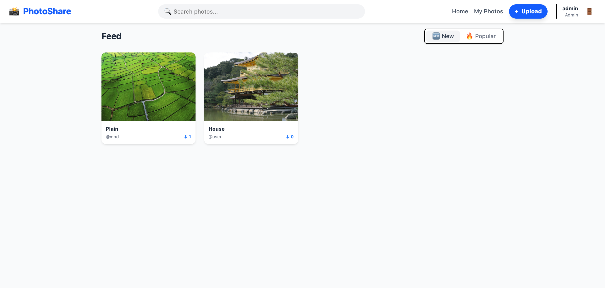
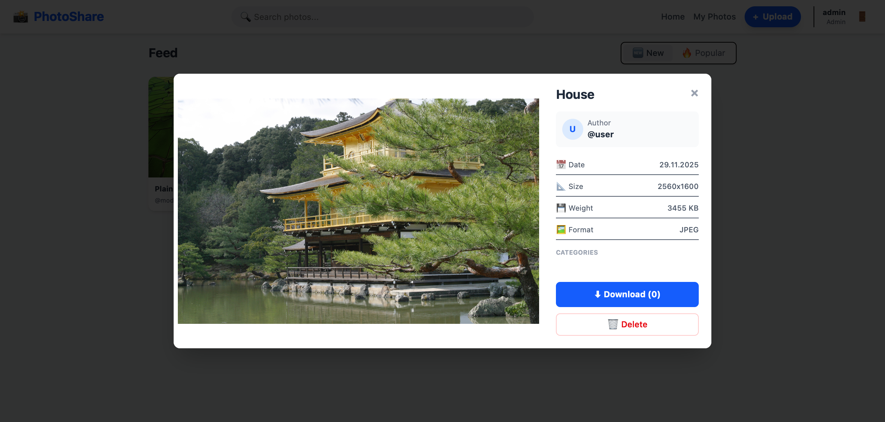

# 📸 PhotoShare App

This is a photo-sharing web application developed as a personal pet project to practice modern web development technologies. Users can upload their images, search for photos by categories, and download works by other authors.

## ✨ Project Features

- **🏠 Core Functionality (App Shell)**

  - **Dynamic Feed**: Photo viewing with sorting options:

  - **🆕 Newest**: Sorted by upload date.

- **🔥 Popular**: Sorted by download count.

- **Smart Search**: Search by title + category filtering.

Single Page Application (SPA): Built with React for a smooth, app-like experience without page reloads.

## 📸 Screenshots

Here is a look at the application in action:

**Login Page**


**Register Page**


**Main Page (Feed)**


**Upload Modal**


**Details Modal**


*Note: Screenshots are stored in the docs/screenshots folder.*

**👤 Roles & Permissions**

- **User:**

  - Register and Login.

  - Upload photos with Drag & Drop.

  - Add tags (categories) via multi-select.

  - Edit/Delete **own** photos.

- **🛡️ Moderator:**

  - **Content Control:** Can delet inappropriate photos uploaded by any user.

  - **Tag Management:** Can edit categories if they are incorrect.

- **👮‍♂️ Administrator:**

  - **User Oversight:** Can reset passwords for users who lost access.

  - **Role Management:** Can promote users to Moderators or Admins.

  - **Global Settings:** Full control over the platform.

## 🛠️ Technologies

- **Frontend:**

  - **React.js:** For building the user interface.

  - **Tailwind CSS:** For modern, responsive styling.

  - **Vite:** For fast frontend tooling.

- **Backend:**

  - **Python & Flask:** REST API to handle data.

  - **SQLAlchemy:** ORM for database management.

- **Database:** SQLite (for development).

## 🚀 How to Run the Project

Since this project uses React and Flask, you need to run two terminals: one for the backend and one for the frontend.

**1. Backend Setup (Flask)**

Open your first terminal:
```bash
cd backend
python -m venv venv
# Activate venv:
# Windows:
venv\Scripts\activate
# Mac/Linux:
source venv/bin/activate

pip install -r requirements.txt
python setup_db.py  # Initialize DB
python app.py       # Runs on localhost:5000
```

**2. Frontend Setup (React + Tailwind)**

Open your second terminal:
```bash
cd frontend
npm install
npm run dev         # Runs on localhost:5173
```

Open your browser at http://localhost:5173 to see the app!

## 📂 Project Structure
```bash
photoshare/
├── backend/               # Python Flask API
│   ├── app.py             # API Routes
│   ├── models.py          # Database Models
│   ├── site.db            # SQLite Database
│   └── uploads/           # Image storage
├── frontend/              # React App
│   ├── src/
│   │   ├── components/    # Reusable UI components (Modals, Cards)
│   │   ├── pages/         # Home, Login, Profile pages
│   │   └── App.jsx        # Main React entry
│   ├── public/
│   ├── tailwind.config.js # Tailwind settings
│   └── package.json       # JS dependencies
├── docs/                  # Documentation & Diagrams
└── README.md              # This file
```

## 🔐 Login Credentials (Test Accounts)

After initializing the DB, the following accounts will be created:

- **Admin:**

  - Login: ```admin```

  - Password: ```admin```

- **Moderator:**

  - Login: ```mod```

  - Password: ```mod```

- **User:**

  - Login: ```user```

  - Password: ```user```

## 📝 Author

Yehor Shnyruk
